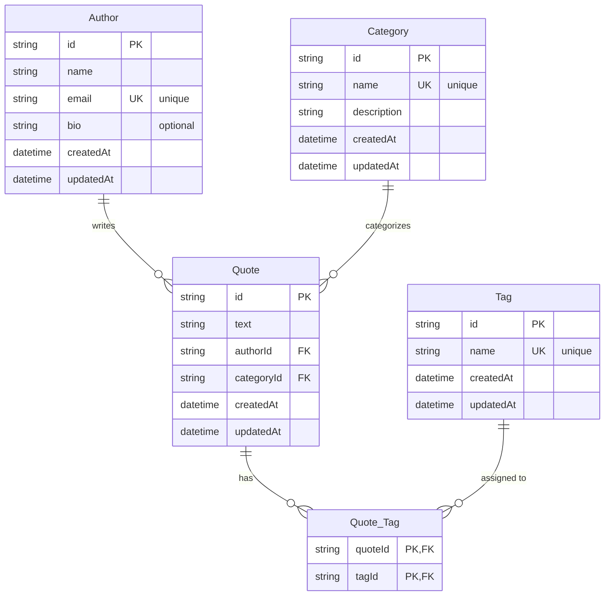

# Quotes Database Schema

This document outlines the database schema for the Quotes system, based on the provided entity-relationship diagram.

## Entity Relationship Diagram

## Table Definitions

### Author
| Column | Constraints | Notes |
| :--- | :--- | :--- |
| `id` | Primary Key | |
| `name` | | |
| `email` | Unique | |
| `bio` | Optional | |
| `createdAt` | | |
| `updatedAt` | | |

### Quote
| Column | Constraints | Notes |
| :--- | :--- | :--- |
| `id` | Primary Key | |
| `text` | | |
| `authorId` | Foreign Key | References `Author.id` |
| `categoryId` | Foreign Key | References `Category.id` |
| `createdAt` | | |
| `updatedAt` | | |

### Category
| Column | Constraints | Notes |
| :--- | :--- | :--- |
| `id` | Primary Key | |
| `name` | Unique | |
| `description` | | |
| `createdAt` | | |
| `updatedAt` | | |

### Tag
| Column | Constraints | Notes |
| :--- | :--- | :--- |
| `id` | Primary Key | |
| `name` | Unique | |
| `createdAt` | | |
| `updatedAt` | | |

### Quote_Tag (Join Table)
| Column | Constraints | Notes |
| :--- | :--- | :--- |
| `quoteId` | Primary Key, Foreign Key | References `Quote.id` |
| `tagId` | Primary Key, Foreign Key | References `Tag.id` |

---

## Implementation Backlog

| # | Task | Depends on |
|---|------|------------|
| 0 | Monorepo restructuring (Phase 0) | — |
| 1 | Author module (CRUD + `GET /authors/:id/quotes`) | 0 |
| 2 | Category module (CRUD + `GET /categories/:id/quotes`) | 0 |
| 3 | Tag module (CRUD + `GET /tags/:id/quotes`) | 0 |
| 4 | Quote module (CRUD + relationships) | 1, 2, 3 |
| 5 | Swagger docs on all endpoints | 4 |
| 6 | README submission | 5 |
